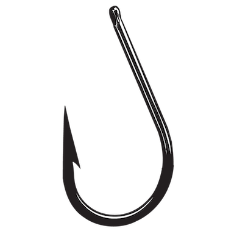

title: Get hooked on React hooks
class: animation-fade
layout: true


<!-- This slide will serve as the base layout for all your slides -->

---

class: impact

# {{title}}
## Mario Fernandez

???

- outline: where are we, what are hooks, why use them, intro, patterns

---

class: middle center

### Where is React today?

???

- I asked myself the same question when I came back to react
- Things move really fast

---

class: center middle

## Times They Are a-Changin

.col-4[

]

.col-4[

]

.col-4[

]

---

class: center middle

.col-6[

]
.col-6[

]

---

class: impact

# What are hooks?

---

class: middle 

> *Hooks* are a new addition in **React 16.8**. They let you use state and other React features without writing a class.

???

Released on February 6th, 2019

---

class: center middle

### Hooks are just functions

---

class: middle

## useState

```typescript
import React, { useState } from 'react'

const Counter = () => {
  const [count, setCount] = useState<number>(0)

  return (
    <div>
      <p>You clicked {count} times</p>
      <button onClick={() => setCount(count + 1)}>
        Click me
      </button>
    </div>
  )
}
```

???

- straight out of the React docs
- value + function

---

```typescript
class Counter extends React.Component {
  constructor(props) {
    super(props)
    this.state = { count: 0 }
  }

  render() {
    return (
      <div>
        <p>You clicked {this.state.count} times</p>
        <button onClick={() => this.setState({count:this.state.count+1})}>
          Click me
        </button>
      </div>
    )
  }
}
```

???

- for comparison, this is the old style, using classes

---

class: center middle

### https://dev.to/dan_abramov/making-sense-of-react-hooks-2eib

???

- more context about the reasons that led to hooks

---

class: impact

# Why hooks?

---

class: center middle

### Functional components over classes

???

- Stylistic reasons
- tree shaking

---

class: center middle

### Encapsulate stateful logic

???

- replace complex solutions like render props or HOC
- avoid changing component hierarchy

---

class: center middle

### Does anybody truly understand lifecycle methods?

???

- eslint started telling me that I should use componentDidMount instead of componentWillMount
- lifecycle methods seem like the most complex part of React


---

class: impact

# useEffect

???

- second main hook to learn

---

class: center middle

### perform side effects

???

- alternative to:
 - componentDidMount
 - componentDidUpdate
 - componentWillUnmount

---

class: middle

```typescript
import React, { useEffect } from 'react'

const Counter = ({ count }: { count: number }) => {
  useEffect(() => {
    document.title = `You clicked ${count} times`;
  });

  return (
    <div>
      <p>You clicked {count} times</p>
    </div>
  )
}
```

???

- gets called every time when the component gets updated

---

class: middle

```typescript
// similar to componentDidMount
useEffect(fn, []);
```


???

- second argument is dependency array

---

class: middle

```typescript
// similar to componentDidMount + componentDidUpdate
useEffect(fn, [counter]);
```

---

class: middle

```typescript
// similar to componentWillUnmount
useEffect(() => {
  return unmountFn
}, [counter]);
```

---

class: center middle

### https://overreacted.io/a-complete-guide-to-useeffect/

???

- `useEffect` has a lot of subtle details

---

class: impact

# Case Study: REST populated component

???

- In my latest project, we have been using hooks to manage state and side effects

---

class: full-width
background-image: url(images/rest-flow.jpg)

---

class: center

```typescript
const Stuff = ({ id }: { id: number }) => {
  const [error, setError] = useState<boolean>(false)
  const [data, setData] = useState<string | undefined>()

  useEffect(() => {
    const fetchData = async () => {
      try {
        setError(false)
        const result = await axios(`/route/${id}`)
        setData(result)
      } catch (e) { setError(true) } 
    }

    fetchData()
  }, [id])
  
  ...
}
```

???

- smaller pieces of state, each with its own `useState`
- defining function inside effect, and then call it (no async)

---

class: middle

```typescript
const Stuff = ({ id }: { id: number }) => {

  ...

  return (
    <>
      {error && 'Oh noooo'}
      {data && <p>{data}</p>}
    </>
  )
}
```

???

- we have this pattern all over our app
- how to avoid duplication?

---

class: center middle

### https://github.com/streamich/react-use

???

- no need to reinvent the wheel
- shows the composable nature of hooks

---

class: center

```typescript
import { useAsync } from 'react-use'

const Stuff = ({ id }: { id: number }) => {
  const { loading, error, value } = useAsync(async () => {
    const result = await axios(`/route/${id}`)
    return result
  }, [id])

  return (
    <>
      {loading && 'Loading...'}
      {error && 'Oh noooo'}
      {value && <p>{value}</p>}
    </>
  )
}
```

???

- using a custom hook (will get to that)
- encapsulate pattern, only a function to fetch data needs to be provided

---

class: impact

# Case Study: Configuration

---

class: full-height
background-image: url(images/config-flow.jpg)

???

- global configuration, maybe fetched from remote
- needs to be accessed deep down in the hierarchy

---

class: center middle

### https://reactjs.org/docs/context.html

???

- context api as an alternative to pass data in a deep hierarchy

---

class: middle

```react
const ConfigContext = React.createContext<ConfigType>(
  initConfig
)
```

---

class: middle

```react
const Config = (props: Props) => {
  const state = useAsync(async (): Promise<ConfigType> => {
    return await configuration()
  }, [])

  const { loading, value } = state
  return (
    <ConfigContext.Provider value={value || initConfig}>
      {!loading && props.children}
    </ConfigContext.Provider>
  )
}
```

---

class: middle

```typescript
const useConfig = () =>
  useContext<ConfigType>(ConfigContext)
```

???

- use a hook for the consumer

---

class: middle

## Consuming context

```typescript
const ConfigClient = () => {
  const { country } = useConfig()
  return (
    <>
      Country from the config: {country}
    </>
  )
}
```

???

- convenient and consistent
- let's compare it to the old way

---

class: middle

## The old way using a HOC

```typescript
const withConfig = <P extends object>(
  WrappedComponent: React.ComponentType<P & WithConfigProps>
) => {
  class WithConfig extends Component<
    Pick<P, Exclude<keyof P, keyof WithConfigProps>>
  > {
    static contextType = ConfigContext
    render() {
      const config: Config = this.context
      const props = { config, ...(this.props as P) }
      return <WrappedComponent {...props} />
    }
  }

  return WithConfig
}
```

---

class: impact

# When all you have is a hook ...

???

- we realized that we are adopting hooks for more and more scenarios 

---

class: middle

```typescript
const auth = useMemo<ContextType>(
  () => ({
    user,
    login,
    logout: () => logout(setUser),
    checkLogin: () => checkLogin(setUser)
  }),
  [user]
)
```

???

- basically replaces `reselect`

---

class: middle

```typescript
const AddressForm = ({ index }: Props) => {
  const { formatMessage } = useIntl()
  return (
    <div className={styles.body}>
      <Input
        name={`addresses.${index}.street`}
        label={formatMessage({ id: 'address.street' })}
      />
    </div>
  )
}
```

???

- many libraries, such as react-intl, bring their own hooks to the table

---

class: impact

# That's kinda cool, huh?

???

- other benefits of using hooks, apart from the ones I mentioned in the beginning

---

class: center middle

### Consistency

---

class: center middle

### Avoid props pollution

---

class: impact

# The elephant in the room

---

class: center middle

### useReducer


???

- you can actually use reducers with hooks
- you have dispatch function that can be passed around, or stored in the context
- you don't have a global store or middleware, like in redux

---

class: center middle

### https://www.robinwieruch.de/react-usereducer-hook

---

class: impact

# Custom Hooks

???

- the natural evolution is to pack your custom domain logic in reusable hooks

---

class: middle

```typescript
const useFieldValues = () => {
  const { locale } = useIntl()
  const { value, loading, error } = useAsync(
    async () => await getFieldValues(locale)
  )
  return { fieldValues: value, loading, error }
}
```

???

- hooks are just functions
- convention: start with *use*

---

class: impact

# Rules of Hooks

---

class: center middle

### Only Call Hooks at the Top Level

---

class: center middle

### Only Call Hooks from React Functions

???

- It boils down to keeping the same order of calls after every update

---

class: middle

```json
{
  "plugins": [
    // ...
    "react-hooks"
  ],
  "rules": {
    // ...
    "react-hooks/rules-of-hooks": "error", // Checks rules of Hooks
    "react-hooks/exhaustive-deps": "warn" // Checks effect dependencies
  }
}
```

???

No need to remember anything, just add the rule to eslint

---

class: impact

# Are we going to test this?

???

- because we actually test stuff

---

class: center middle

```typescript
import { waitForElement, render } from '@testing-library/react'
import RecipeDetails from './RecipeDetails'

jest.mock('recipe-details/recipeDetails.service')

describe('RecipeDetails', () => {
  it('renders correctly', async () => {
    const { getByText } = render(<RecipeDetails id={1} />)
    await waitForElement(() => getByText('Pasta Carbonara'))
  })
})
```

???

- If you are using `react-testing-library`, no need to change anything
- `enzyme` is not supposed to play very well with hooks

---

class: center middle

```typescript
import { renderHook, act } from '@testing-library/react-hooks'
import useCounter from './useCounter'

test('should increment counter', () => {
  const { result } = renderHook(() => useCounter())

  act(() => {
    result.current.increment()
  })

  expect(result.current.count).toBe(1)
})
```

???

- hooks can be tested separately by adding this package
- shouldn't be really needed unless building custom hooks for very different use cases

---

class: impact


# Are hooks ready for prime time?

---

class: center middle

### Yes!

---

class: impact

# Links

---

class: middle

- https://reactjs.org/docs/hooks-intro.html
- https://wattenberger.com/blog/react-hooks
- https://www.robinwieruch.de/react-hooks-fetch-data

---

